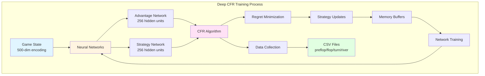
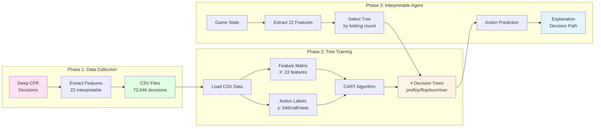
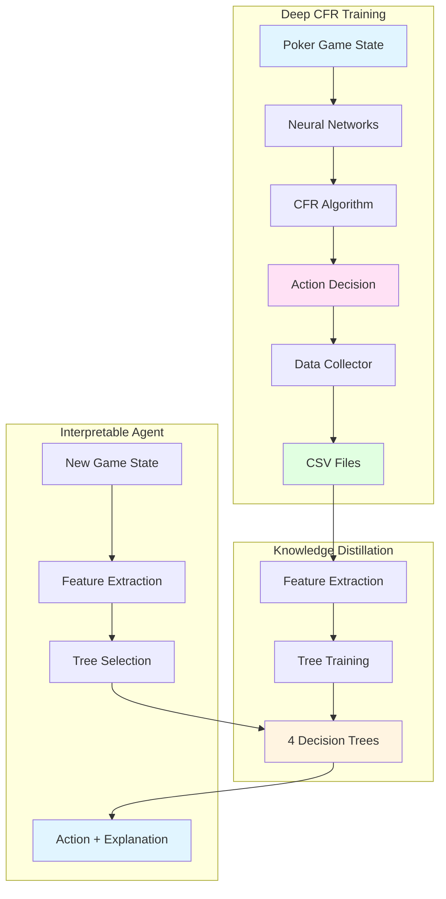
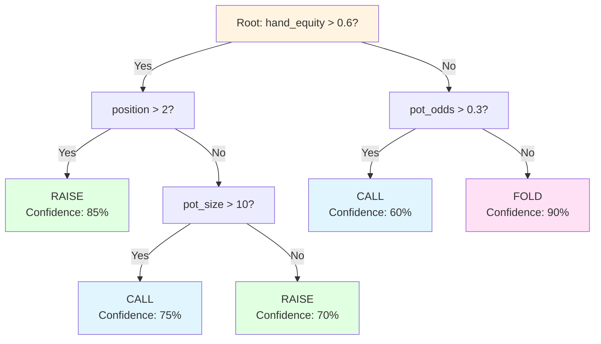

# Deep CFR & Interpretable Agent Architecture Diagrams

This document contains comprehensive diagrams explaining the Deep CFR infrastructure, training process, and the Interpretable Agent system.

## Table of Contents
1. [Deep CFR Architecture & Training](#diagram-1-deep-cfr-architecture--training)
2. [Interpretable Agent Training (Knowledge Distillation)](#diagram-2-interpretable-agent-training-knowledge-distillation)
3. [Complete System Flow](#diagram-3-complete-system-flow)
4. [Decision Tree Structure Example](#diagram-4-decision-tree-structure-example)

---

## Diagram 1: Deep CFR Architecture & Training

### Mermaid Version:


### Text Version:
```
┌─────────────────────────────────────────────────────────────┐
│              DEEP CFR ARCHITECTURE & TRAINING               │
└─────────────────────────────────────────────────────────────┘

┌──────────────┐
│ Game State   │
│ 500-dim      │
│ • Cards      │
│ • Pot        │
│ • Position   │
│ • Actions    │
└──────┬───────┘
       │
       ▼
┌─────────────────────────────────────┐
│      Neural Networks               │
│  ┌───────────────────────────────┐ │
│  │ Advantage Network             │ │
│  │ • Input: 500-dim              │ │
│  │ • Hidden: 256 units          │ │
│  │ • Output: Regret values      │ │
│  └───────────────────────────────┘ │
│  ┌───────────────────────────────┐ │
│  │ Strategy Network              │ │
│  │ • Input: 500-dim              │ │
│  │ • Hidden: 256 units          │ │
│  │ • Output: Action probabilities│ │
│  └───────────────────────────────┘ │
└──────────────┬──────────────────────┘
               │
               ▼
┌─────────────────────────────────────┐
│      CFR Algorithm                 │
│  • Counterfactual Regret Minimization│
│  • Game Tree Traversal             │
│  • Regret Matching                 │
│  • Strategy Updates                │
└──────────────┬──────────────────────┘
               │
       ┌───────┴───────┐
       ▼               ▼
┌──────────────┐  ┌──────────────┐
│ Memory       │  │ Data         │
│ Buffers      │  │ Collection   │
│ • Advantage  │  │ • Features   │
│ • Strategy   │  │ • Actions    │
└──────┬───────┘  └──────┬───────┘
       │                 │
       ▼                 ▼
┌──────────────┐  ┌──────────────┐
│ Network      │  │ CSV Files    │
│ Training     │  │ • preflop.csv │
│ • Adam       │  │ • flop.csv    │
│ • Huber Loss │  │ • turn.csv    │
└──────────────┘  │ • river.csv  │
                  └──────────────┘
```

---

## Diagram 2: Interpretable Agent Training (Knowledge Distillation)

### Mermaid Version:


### Text Version:
```
┌─────────────────────────────────────────────────────────────┐
│         INTERPRETABLE AGENT TRAINING PROCESS                │
└─────────────────────────────────────────────────────────────┘

PHASE 1: DATA COLLECTION
┌──────────────┐
│ Deep CFR     │
│ Makes        │
│ Decisions    │
└──────┬───────┘
       │
       ▼
┌──────────────────────┐
│ Extract 22 Features  │
│ • hand_equity        │
│ • pot_odds           │
│ • position           │
│ • pot_size_bb        │
│ • ... (18 more)      │
└──────┬───────────────┘
       │
       ▼
┌──────────────────────┐
│ CSV Files            │
│ • preflop_decisions  │
│ • flop_decisions     │
│ • turn_decisions     │
│ • river_decisions    │
│ Total: 73,046 rows   │
└──────┬───────────────┘
       │
       ▼
PHASE 2: TREE TRAINING
┌──────────────────────┐
│ Load CSV Data        │
│ X: [22 features]     │
│ y: [actions]         │
└──────┬───────────────┘
       │
       ▼
┌──────────────────────┐
│ CART Algorithm        │
│ • Gini Criterion      │
│ • Grid Search         │
│ • Cross-validation    │
└──────┬───────────────┘
       │
       ▼
┌──────────────────────┐
│ 4 Decision Trees      │
│ • preflop_tree.pkl   │
│ • flop_tree.pkl      │
│ • turn_tree.pkl      │
│ • river_tree.pkl     │
└──────────────────────┘
       │
       ▼
PHASE 3: INTERPRETABLE AGENT
┌──────────────┐
│ Game State   │
└──────┬───────┘
       │
       ▼
┌──────────────────────┐
│ Extract 22 Features │
└──────┬───────────────┘
       │
       ▼
┌──────────────────────┐
│ Select Tree          │
│ (by betting round)   │
└──────┬───────────────┘
       │
       ▼
┌──────────────────────┐
│ Tree Prediction      │
│ • Action category    │
│ • Decision path      │
│ • Explanation        │
└──────────────────────┘
```

---

## Diagram 3: Complete System Flow

### Mermaid Version:


### Text Version:
```
┌─────────────────────────────────────────────────────────────┐
│                    COMPLETE SYSTEM FLOW                     │
└─────────────────────────────────────────────────────────────┘

┌─────────────────────────────────────────────────────────────┐
│              DEEP CFR TRAINING (Teacher)                    │
├─────────────────────────────────────────────────────────────┤
│                                                              │
│  Poker State → Neural Networks → CFR → Decision              │
│      │              │            │        │                 │
│      ▼              ▼            ▼        ▼                 │
│  [500-dim]    [Advantage Net]  [Regret]  [Action]          │
│              [Strategy Net]    [Minimize]                   │
│                                      │                        │
│                                      ▼                        │
│                              Data Collector                  │
│                              • Extract 22 features           │
│                              • Record action                  │
│                                      │                        │
│                                      ▼                        │
│                              CSV Files                       │
│                              • preflop_decisions.csv         │
│                              • flop_decisions.csv            │
│                              • turn_decisions.csv            │
│                              • river_decisions.csv           │
└─────────────────────────────────────────────────────────────┘
                              │
                              ▼
┌─────────────────────────────────────────────────────────────┐
│         KNOWLEDGE DISTILLATION (Student Learning)            │
├─────────────────────────────────────────────────────────────┤
│                                                              │
│  CSV Files → Feature Matrix → CART Algorithm → Trees       │
│      │            │              │              │            │
│      ▼            ▼              ▼              ▼            │
│  [73,046]    [X: 22 features]  [Gini]    [4 Trees]          │
│  decisions   [y: actions]      [Grid     [preflop/          │
│                                Search]   flop/turn/         │
│                                          river]              │
└─────────────────────────────────────────────────────────────┘
                              │
                              ▼
┌─────────────────────────────────────────────────────────────┐
│         INTERPRETABLE AGENT (Player)                       │
├─────────────────────────────────────────────────────────────┤
│                                                              │
│  New Game State → Extract Features → Select Tree → Action   │
│       │                │              │            │         │
│       ▼                ▼              ▼            ▼         │
│  [Poker State]   [22 features]   [By street]   [Action]    │
│                  • hand_equity   • preflop    • fold        │
│                  • pot_odds      • flop       • call        │
│                  • position      • turn       • raise       │
│                  • ...           • river                    │
│                                                              │
│                              │                               │
│                              ▼                               │
│                    Explanation Generation                    │
│                    • Decision path                           │
│                    • Feature importance                       │
│                    • Human-readable rules                     │
└─────────────────────────────────────────────────────────────┘
```

---

## Diagram 4: Decision Tree Structure Example

### Mermaid Version:


### Text Version:
```
┌─────────────────────────────────────────────────────────────┐
│              DECISION TREE STRUCTURE EXAMPLE                │
└─────────────────────────────────────────────────────────────┘

                              Root
                    hand_equity > 0.6?
                    /              \
                  YES              NO
                 /                  \
        position > 2?          pot_odds > 0.3?
        /          \            /          \
      YES          NO         YES          NO
      /            \          /            \
   RAISE      pot_size > 10?  CALL        FOLD
  (85%)       /          \    (60%)      (90%)
            YES          NO
            /            \
         CALL          RAISE
        (75%)         (70%)

Decision Path Example:
- hand_equity > 0.6? ✓ (0.65)
- position > 2? ✓ (late position)
→ Decision: RAISE (85% confidence)
```

---

## Key Concepts Explained

### Deep CFR (Counterfactual Regret Minimization)
- **Game Theory Algorithm**: Finds Nash equilibrium strategies
- **Neural Networks**: Approximate regret values and strategies
- **Training**: Self-play against random opponents and checkpoints
- **Output**: Optimal poker strategies

### Knowledge Distillation
- **Teacher**: Deep CFR neural networks
- **Student**: Decision trees (CART)
- **Process**: Trees learn to replicate Deep CFR decisions
- **Benefit**: Interpretability + Performance

### Interpretable Agent
- **Input**: 22 interpretable features (hand equity, pot odds, position, etc.)
- **Model**: 4 decision trees (one per betting round)
- **Output**: Action + human-readable explanation
- **Speed**: <1ms per decision

---

## How to Use These Diagrams

### For Presentations:
1. **Mermaid Diagrams**: 
   - Render at https://mermaid.live/
   - Or use VS Code with Mermaid extension
   - Works in GitHub, Notion, Obsidian

2. **Text Diagrams**:
   - Copy directly into slides
   - Works in PowerPoint, Google Slides, Keynote
   - Can be styled with colors/fonts

### Recommended Usage:
- Use one diagram per slide
- Add titles and brief explanations
- Use colors to highlight key components
- Include code examples where relevant

---

## References

- Deep CFR Paper: Brown & Sandholm (2019) - "Deep Counterfactual Regret Minimization"
- CART Algorithm: Breiman et al. (1984) - "Classification and Regression Trees"
- Knowledge Distillation: Hinton et al. (2015) - "Distilling the Knowledge in a Neural Network"

